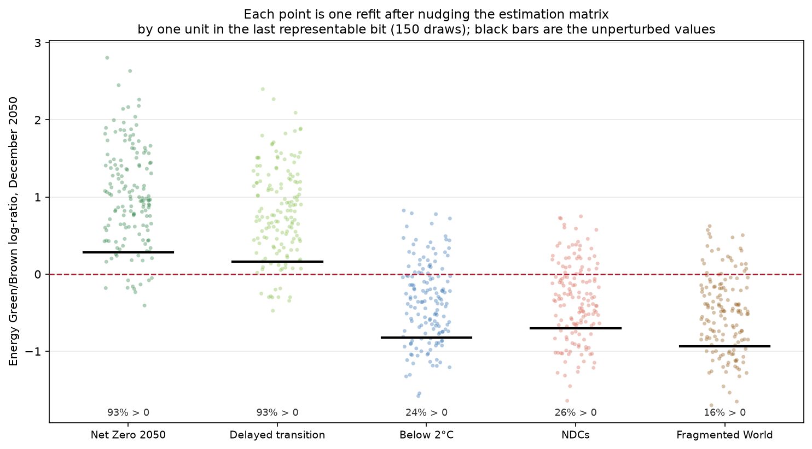

# Stock market returns under different climate scenarios

Is the Green–Brown return differential *within the same sector* a structural feature of a
portfolio, or does it depend on which climate scenario the economy follows? This repository
contains the Python replication of the modelling pipeline built to answer that question, together
with the main results of the thesis.

## Replication note

The estimation in the thesis was done in MATLAB. The code here is a Python replication of that
pipeline: same panel, same feature-engineering rule, same 73-feature winning set, same Gradient
Boosting configuration, same two estimation windows.

The replication reproduces the thesis. On the sealed test block the in-sample figures agree to nine
decimals; over the 51,480 monthly log-ratio values of the scenario projection the largest deviation
from the MATLAB export is 1.4e-05. Getting there required two things that are easy to miss, and
both are documented below: the projection is produced by a second fit on a longer window, and
MATLAB's tree growth policy has no equivalent in scikit-learn and had to be written out
([`src/matlab_policy_gb.py`](src/matlab_policy_gb.py)).

Thesis values and replication values are labelled wherever both appear, and never mixed.

A word on what "reproduces" means here, because this repository also measures the answer to a
harder question. Agreement to 1.4e-05 says the Python code walks the same path as the MATLAB code.
It does not say the path is stable: perturbing the estimation matrix by a single unit in the last
representable bit moves the headline projection by half a point. Both facts are reported —
see [How stable is the projection](#how-stable-is-the-projection).

## Setup

22 US sector portfolios (11 GICS sectors, each split into an ESG top-25% "Green" and a bottom-25%
"Brown" leg), monthly data 2005–2024. Four models are compared out-of-sample on a sealed
2021–2024 test block; the winner is projected on the NGFS scenarios to 2050; the final metric is
the within-sector Green/Brown log-ratio.

## Repository layout

```
src/
  build_features.py   24 drivers -> 552 candidates -> 73-feature winning set,
                      validated column by column against the MATLAB design matrix
  train_gb.py         the two fits (189 months for metrics, 237 for the
                      projection) and the three growth policies
  evaluate.py         out-of-sample R2 and RMSE on the sealed test block
  interpret.py        PDP and ICE curves for the six defence pairs
  scenarios.py        2025-2050 projection and Green/Brown log-ratio
  matlab_policy_gb.py LSBoost with MATLAB's tree growth policy, in numpy:
                      breadth-first growth under a split budget, with the
                      per-level undo rule that scikit-learn does not offer
scripts/
  make_figures.py     regenerates everything in figures/
  make_tables.py      builds results/mean_differences_table.csv
  reexport_data_private.py    rewrites the private CSVs at %.17g so they
                      round-trip exactly; run once, before anything else
  measure_conditioning_dense.py perturbation sweep at the last representable
                      bit, 150 draws per magnitude, in parallel
  verify_237_months.py  reads the four .mat inputs directly and compares the
                      189-month and 237-month refits
  phase0_diagnostics.py  importance fingerprint, capacity probe, extrapolation
  compare_growth_policies.py  the three growth policies side by side
  task1_bestfirst_fitb.py     best-first upper bound on the projection
  task2_matlab_policy.py      the MATLAB policy on both samples
results/              thesis exports + replication outputs
figures/              all figures used below
```

Run order, from the repository root:

```bash
python src/build_features.py && python src/train_gb.py && python src/evaluate.py && python src/interpret.py && python src/scenarios.py && python scripts/make_tables.py && python scripts/make_figures.py
```

The `src/` steps need `data_private/`, which is not distributed (see
[Data availability](#data-availability)). `scripts/make_tables.py` and the thesis-based figures run
from the CSVs in `results/` alone.

### Regenerable outputs

Four monthly projection dumps are excluded from version control, at roughly 14 MB each. They are
deterministic, so re-running the script that wrote them reproduces them byte for byte:

| File | Recreated by |
| --- | --- |
| `results/verifica_237_mesi/scenario_monthly_fitA.csv` | `python scripts/verify_237_months.py` |
| `results/verifica_237_mesi/scenario_monthly_fitB.csv` | `python scripts/verify_237_months.py` |
| `results/task1/scenario_monthly_fitB_bestfirst.csv` | `python scripts/task1_bestfirst_fitb.py` |
| `results/task2/scenario_monthly_fitB_matlabpolicy.csv` | `python scripts/task2_matlab_policy.py` |

The aggregated log-ratio files and the text reports in the same folders are small and stay tracked,
so the conclusions are readable without regenerating anything. Note that these four scripts read the
`.mat` inputs directly and therefore need the private data.

The MATLAB exports in `results/` are a different matter and stay tracked:
`results/logratio_green_brown.csv` in particular is the reference the replication is compared
against, and it cannot be rebuilt without MATLAB.

---

## 1. Why machine learning is necessary, not decorative

The linear panel cannot answer the research question, by construction. In that specification Green
enters only as an intercept shift (δ ≈ −0.63) with no interaction terms. Projected on the five
scenarios, it returns the same differential in all five. A linear model of this form can only ever
say "structural"; it has no way to represent a scenario-dependent answer.

The differential lives in the interactions. Any effect common to both legs of a sector cancels in
the log-ratio, so only a driver tied to one specific portfolio can open a gap. That is what the
candidate space is built for: 552 features, made of 24 driver-lags interacted with 22 entities plus
the 24 main effects. The panel is split 70-10-20, with the last block sealed and untouched until
the final evaluation.

`src/build_features.py` rebuilds this space from the base panel and checks itself against the
matrix built in MATLAB: on the tr70 + va10 sample the two agree column by column, with a maximum
absolute difference of 0.

## 2. Model selection by four criteria, not by R²


The four models are nearly tied out-of-sample: Elastic Net 0.389, Random Forest 0.401, Panel 0.404,
Gradient Boosting 0.406. A gap of 0.017 across four very different specifications is not a ranking.

The choice was made by progressive elimination on four criteria:

| Criterion | Consequence |
|---|---|
| No standardisation required | rules out Elastic Net |
| Non-linearity needed | rules out Elastic Net and the panel |
| Determinism | rules out Random Forest |
| Parsimony | 73 features against 155 |

Gradient Boosting is the only model not dominated on any of the four. Its configuration — 73
features, depth 4, learning rate 0.03, 300 trees, no subsampling — comes from the thesis and is
refit here without any further tuning. Fit is confirmation, not reason.

**Replication against thesis, FIT A on the sealed 2021–2024 test block:**

| Metric | Thesis (MATLAB) | Replication (Python) |
|---|---|---|
| R² in-sample | 0.706548873843745 | 0.706548874290826 |
| RMSE in-sample | 3.8182342232388 | 3.818234220330205 |
| R² out-of-sample | 0.4064289 | 0.4066954 |
| RMSE out-of-sample | 5.1082591 | 5.1071122 |

The in-sample figures agree to nine decimals, which is what identifies the growth policy as correct.
The out-of-sample figures differ in the fourth, and the asymmetry has a mechanical cause: split
thresholds are midpoints between adjacent *training* values, so no training row ever sits near a
boundary, while test rows have no such protection and a few of them fall on the other side of a
threshold that differs in its last bits.


The importance ranking comes across too: the contemporaneous market factor takes 68.69% of the
budget against 68.71% in the thesis, aggregate terms take 76.8% against roughly 77%, and one
predictor has zero importance in both.

## 3. Interpretability with a built-in falsification test


The partial dependence curves are step functions even in the channels that are close to linear —
the market channel has a linear R² of 0.95 and still produces steps. The same variable takes
different shapes on different portfolios: this is exactly the heterogeneity the linear panel cannot
see, because there the same coefficient is imposed everywhere.


The ICE curves are parallel. That matters: it means the average curve is representative of the
individual observations and not an artefact of averaging over conflicting shapes. If the individual
curves crossed, the PDP would be a summary of nothing.

Both figures are recomputed in Python on the replicated model, following the sweep logic of the
thesis: an interaction feature is non-zero only on the rows of its own entity, so the grid is
applied to those rows and the predictions are averaged over them.

The falsification test is the pivot between two sectors. Communication carries the heaviest
interaction budget — 24% of it, of which 13.8 sits on temperature — and it barely separates the
scenarios (range 0.11). Energy carries less — 16%, of which 14.3 sits on fuel — and it separates
everything (range 0.39). The reason is not in the model but in the drivers: temperature paths do
not diverge across scenarios by 2050, fuel paths do. What matters is the channel, not the weight.
When the model does not separate, it is because the driver does not separate. In the thesis model,
interactions take 23% of the total importance budget (19.9% in the replication).

## 4. What the model finds


Energy is the sector where the scenario matters most, and the robust part of the finding is which
pathways put the green leg ahead. In the transition component at 2050, Net Zero +0.29 and Delayed
transition +0.16 are both positive; NDCs −0.70, Below 2°C −0.82 and Fragmented World −0.93 are
below them.

The ordering is not a simple ranking of ambition. It takes ambition *and* speed together: Net Zero
and Delayed transition have both, Below 2°C has ambition without speed, Fragmented World has speed
without ambition, NDCs has neither. This is the part that holds up: under perturbation of the
estimation matrix at the last representable bit, Net Zero and Delayed transition are both positive
in 93.3% of draws, 95% interval [88.2%, 96.3%].

The crossing of zero is a different kind of statement, and a weaker one. Whether the remaining
three pathways land below zero or merely below Net Zero is a property of the *level* of the
log-ratio, and the level moves with the estimation window and with the numerical detail of the fit.
All three are negative together in 70.7% of the same draws, [62.9%, 77.4%]. So the reading to take
away is Net Zero at the green extreme, not "Energy inverts its sign" — a claim that is true of this
particular fit rather than of the sector. Appendix A.3 of the thesis treats the crossing the same
way.

The left panel is the other half of the finding, and it is kept in the figure on purpose: under the
physical component the five scenarios lie exactly on top of each other. The Energy spread across
scenarios is 0.00 for physical against 1.22 for transition. All of the separation is transition
risk.


Materials behaves differently. The brown leg is ahead under every pathway; only the size of the gap
changes, from −1.67 under Net Zero (tightest) to −2.62 under NDCs (widest). The shock enters as a
cost rather than as an advantage: green does not become better, it becomes less bad.

### Why the projection needed two things to come out right

The Python projection first came out at a spread of 0.25 against the thesis 1.22. Two independent
causes accounted for the gap, and neither was sufficient on its own.

**The estimation window.** The MATLAB pipeline fits the same configuration twice. `refit_finale_K62.m`
fits 189 months, up to December 2020, and exists to certify the out-of-sample metrics on the sealed
block. `s3_K62_leaf10.m` fits 237 months, everything up to December 2024, and it is this second fit
that produces the projection — the design is stated in appendix A.3 of the thesis. The Python side
was projecting from the 189-month fit, that is, from a model that stops before the test block.

**The tree growth policy.** `MaxNumSplits = 15` is a budget on the number of splits, spent
breadth-first, not a depth limit. It coincides with `max_depth = 4` only for a complete tree, since
1 + 2 + 4 + 8 = 15 branch nodes. The trees here are not complete, so the two policies part company:
`max_depth = 4` averaged 8.7 splits per tree, and that shortfall was truncation, not an unused
budget — nodes at the fourth level were still splittable and scikit-learn closed them anyway. Under
the MATLAB policy every one of the 300 trees spends all 15 splits, reaching depth 12.

The difference from best-first growth is therefore not *how many* splits but *where* they go.
Level-wise growth spends them on breadth before depth; best-first spends them wherever the gain is
largest. scikit-learn offers both `max_depth` and `max_leaf_nodes` and neither is the MATLAB
procedure, which is why [`src/matlab_policy_gb.py`](src/matlab_policy_gb.py) exists.

The three policies bracket the thesis on every axis at once, which is what makes the match
non-accidental:

| Growth policy | R² in-sample | R² out-of-sample | splits/tree | Energy 2050 spread |
|---|---|---|---|---|
| `max_depth=4`, level-wise truncated | 0.6503 | 0.4103 | 8.74 | 0.5213 |
| **numpy builder, MATLAB policy** | **0.7065** | **0.4067** | **15.00** | **1.2199** |
| `max_leaf_nodes=16`, best-first | 0.7192 | 0.3965 | 15.00 | 1.4251 |
| thesis (MATLAB) | 0.7065 | 0.4064 | not reported | 1.2199 |

The thesis sits between the two scikit-learn policies on in-sample fit, out-of-sample fit and
projection simultaneously, and in the direction level-wise growth predicts. The two variants are
kept in the code as labelled diagnostics for that reason.

**The risk-free path.** `s3_K62_leaf10.m` compounds `total = yhat + RF`. The Python projection was
compounding `yhat` alone, which is a missing term rather than a refinement. The scenario design file
carries no risk-free column, so the path is joined from the thesis predictions export, where RF is
constant across entities within a scenario, component and month.

### Reading a CSV is not free

The private inputs are CSV exports of MATLAB doubles, and getting them back intact takes two
separate precautions. Neither is sufficient alone:

| Written with | Read with | Deviation from the MATLAB doubles |
|---|---|---|
| default precision | default parser | 4.97e-14 |
| default precision | `float_precision="round_trip"` | 4.97e-14 |
| `%.17g` | default parser | 1.42e-14 |
| **`%.17g`** | **`float_precision="round_trip"`** | **0** |

The original files simply carried too few digits, so no parser could recover them. The re-exported
files carry enough, but pandas' default CSV parser is fast rather than correctly rounded and puts
about 1e-14 back in. Both together give an exact round-trip, and only then does the pipeline
reproduce 1.219885 rather than 1.4631.

This is worth knowing outside this project: a 5e-14 discrepancy in an input file is invisible in
every diagnostic anyone normally looks at, and here it moved the headline result by twenty per cent.

### How stable is the projection

Fixing the export removed one particular perturbation. It did not remove the sensitivity that made
that perturbation matter, so the sensitivity itself was measured
([`scripts/measure_conditioning_dense.py`](scripts/measure_conditioning_dense.py)).

The 237-month estimation matrix is perturbed with relative noise, the model is refitted from
scratch and the projection recomputed, 150 draws per magnitude with fixed seeds. At 1e-16, below
the double epsilon of 2.2e-16, only about a fifth of the non-zero cells change at all and each by a
single unit in the last place.

Two magnitudes are reported, not more. Coarser perturbations were swept first at eight draws each,
and those numbers turned out to measure nothing: re-running them with a different set of seeds moved
the mean spread by 0.16 to 0.22, the same size as the differences being compared. Eight draws cannot
support a comparison of means, or separate one proportion from another, so those levels were dropped
rather than reported with caveats.

| Perturbation | Energy 2050 spread | sign pattern kept | Net Zero and Delayed both positive |
|---|---|---|---|
| none | 1.2199 | — | — |
| 1e-16, one unit in the last place | mean 1.539, range 0.83 to 2.33 | 64.0% [56.1, 71.2] | 93.3% [88.2, 96.3] |
| 1e-15 | mean 1.552, range 0.61 to 2.32 | 56.7% [48.7, 64.3] | 96.0% [91.5, 98.2] |

Three things follow. The magnitude of the spread is not identified at double precision: flipping the
last bit of a fifth of the matrix moves it by half a point. The unperturbed value of 1.2199 is not a
central value of that distribution but sits at its thirteenth percentile. And the two magnitudes are
not distinguishable from one another, so the sensitivity is saturated at one bit rather than growing
with the perturbation.

What survives is narrower than the full pattern, and it is the reading highlight 4 is built on: Net
Zero and Delayed transition both positive, in 93.3% of draws.



One asymmetry has to be stated, because it qualifies both headline shares and it qualifies them in
opposite directions. The perturbation does not scatter the draws symmetrically around the
unperturbed fit: it shifts every scenario upward, by between +0.37 and +0.70 at the median, so each
unperturbed value sits between the twelfth and the twenty-fourth percentile of its own distribution.
The likely reason is that the unperturbed design carries exact ties — most interaction columns are
exactly zero on most rows — and perturbing it breaks them, letting the tree make splits the original
data cannot support.

So the 93.3% for "Net Zero and Delayed both positive" is measured on draws pushed toward positive
values and is, if anything, generous; the 70.7% for "all three remaining pathways negative" is
measured on the same draws pushed away from negative values and is, if anything, harsh. Neither
share should be read as a probability that the finding is true. They are both descriptions of how a
deterministic procedure behaves when its arithmetic is disturbed.

**This measures the procedure, not the estimate.** It is the numerical conditioning of the fit with
respect to its own regressors — how much the answer moves when the arithmetic is nudged. It is not a
confidence interval, it carries no information about sampling error, and the intervals above are
binomial intervals on a share of draws, not on a population parameter. The statistical uncertainty
of the estimate is a separate question, addressed in the thesis and not here. Two neighbouring
conditioning questions are also *not* measured: sensitivity to the scenario design, and sensitivity
to the target. Only the estimation matrix is perturbed.

### How closely the replication matches

Over the full projection — 11 sectors x 5 scenarios x 3 components x 312 months, 51,480 values —
the largest deviation from the MATLAB export is **1.410e-05** and the mean deviation is 1.006e-06.
The worst cell is Communication under Delayed transition in December 2050, where the log-ratio is
−6.528841 against −6.528855, a relative error of 2.2e-06. That residual sits above the six-decimal
rounding of the export, so it is a real numerical difference and not a display artefact: the
floating-point tie-breaks inside the two splitters are not exposed by either library.

### Mean 2025–2050 differences, thesis results

Average over 2025–2050 of the monthly difference between the predicted return of the Green and the
Brown portfolio of each sector, by scenario, with the range across scenarios in the last column.
These come from the thesis output, not from the replication. No significance tests are reported
here; the tests are in the thesis.

**Transition component**

| Sector | Net Zero | Delayed | Below 2C | NDCs | Fragmented | Range |
|---|---|---|---|---|---|---|
| CDSC | 0.224 | 0.215 | 0.224 | 0.224 | 0.215 | 0.009 |
| COMM | -2.051 | -2.150 | -2.036 | -2.085 | -2.136 | 0.114 |
| CSTP | -0.246 | -0.225 | -0.246 | -0.231 | -0.231 | 0.021 |
| ENRG | 0.092 | 0.053 | -0.267 | -0.227 | -0.303 | 0.395 |
| FIN | 0.000 | 0.001 | 0.000 | 0.000 | 0.000 | 0.001 |
| HLTC | -0.165 | -0.165 | -0.165 | -0.165 | -0.165 | 0.000 |
| IND | -0.112 | -0.108 | -0.112 | -0.112 | -0.108 | 0.004 |
| INFT | -0.623 | -0.648 | -0.594 | -0.616 | -0.622 | 0.054 |
| MATS | -0.544 | -0.660 | -0.545 | -0.856 | -0.660 | 0.312 |
| REIT | -0.012 | -0.016 | -0.012 | -0.014 | -0.014 | 0.004 |
| UTIL | 0.000 | 0.000 | 0.000 | 0.000 | 0.000 | 0.000 |

**Physical component**

| Sector | Net Zero | Delayed | Below 2C | NDCs | Fragmented | Range |
|---|---|---|---|---|---|---|
| CDSC | 0.224 | 0.224 | 0.224 | 0.224 | 0.224 | 0.001 |
| COMM | -1.970 | -2.091 | -1.974 | -2.081 | -2.073 | 0.121 |
| CSTP | -0.246 | -0.231 | -0.246 | -0.231 | -0.231 | 0.016 |
| ENRG | -0.323 | -0.323 | -0.323 | -0.323 | -0.323 | 0.000 |
| FIN | 0.000 | 0.000 | 0.000 | 0.000 | 0.000 | 0.000 |
| HLTC | -0.165 | -0.165 | -0.165 | -0.165 | -0.165 | 0.000 |
| IND | -0.112 | -0.112 | -0.112 | -0.112 | -0.112 | 0.000 |
| INFT | -0.605 | -0.598 | -0.605 | -0.600 | -0.600 | 0.007 |
| MATS | -1.102 | -1.099 | -1.102 | -1.099 | -1.099 | 0.002 |
| REIT | -0.020 | -0.019 | -0.020 | -0.020 | -0.020 | 0.001 |
| UTIL | 0.000 | 0.000 | 0.000 | 0.000 | 0.000 | 0.000 |

Full table: [`results/mean_differences_table.csv`](results/mean_differences_table.csv).

## 5. Conclusion: conditional, but local

The response to the pathway is graded, not binary, and it is concentrated. Ranking the 11 sectors by
the range of their mean 2025–2050 differential across scenarios: Energy 0.395 and Materials 0.312
stand apart; Communication 0.114 and Information Technology 0.054 are small but not nothing; the
remaining seven are at 0.02 or below, four of them at 0.00.

An earlier version of this section counted sectors by whether their log-ratio crosses zero — "nine
structural, two move, one inverts". That count is not reported any more, because it classifies
sectors by a threshold that is not stable. Crossing zero is a property of the level, and the level
moves with the estimation window and with the numerical detail of the fit. Ranking by response is
the more durable statement, and it does not need a cut-off: Energy first by a wide margin,
Materials second, everything else far behind.

So the answer to the research question is not "structural" and not "conditional", but conditional in
a specific place and through a specific channel. In Energy the channel is fuel, the pathways that
favour the green leg are the ones combining ambition with speed, and the ranking they produce holds
up under perturbation where the absolute levels do not.

## Limitations and future work

**Why the gains over the linear benchmark are modest.** Most of the predictable variance comes from
the contemporaneous market factor, which is linear, so the ceiling for improvement was low by
construction of the problem. Monthly equity returns have a very low signal-to-noise ratio, and
roughly 190 effective training months limit what trees can learn — consistent with what Gu, Kelly
and Xiu report for machine learning in asset pricing. Machine learning was chosen here for
expressiveness, not for fit: the linear model cannot even represent a scenario-dependent
differential, by construction. R² measures total-return prediction, while the object of interest is
a second-order differential that R² barely sees.

**Style factors are excluded.** No scenario path exists for them, so they cannot be projected. The
within-sector design attenuates the omission but does not remove it.

**The time dimension is narrow from both sides.** The data are monthly while the NGFS scenarios are
annual, and ESG coverage thins out before 2005.

**A single ESG provider.** Ratings diverge across providers, and the Green/Brown sorting inherits
that choice.

**Scenario paths are smooth by construction.** The projections should be read as directions of
adjustment, not as magnitudes. The thesis reaches that conclusion from the low volatility of the
NGFS paths; the conditioning measured here is a second, independent reason for the same caution,
and a sharper one. The projected fuel path over 2025–2050 spans roughly 0.04 to 1.85, about three
per cent of the range the model was trained on and sitting close to its median. A boosted tree is a
step function, so over an interval that narrow the answer depends on whether a step edge happens to
fall inside it — which is why the magnitude moves under perturbations at the last representable bit
while the ranking does not.

**No MATLAB was re-run.** Every comparison in this repository is against exported files, not against
a live MATLAB session. The `.m` scripts are not under version control; their provenance is
documented below but not verified. The average number of splits and leaves in the MATLAB trees is
not reported in the thesis and not present in the exports, so the 15.00 and 16.00 produced by the
builder cannot be checked against the original directly — the in-sample agreement to nine decimals
is the indirect evidence that stands in for it.

**The perturbation measures slightly more than numerical sensitivity.** The noise is relative, so
the 78.9% of cells that are exactly zero — the interaction columns are zero wherever the row belongs
to another entity — stay exactly zero, and the structural sparsity of the design is preserved. What
is not preserved is the repetition. A macroeconomic driver takes one value per month and that value
is carried by all 22 portfolios, so a main-effect column of 5,214 rows holds only about 35 distinct
values, each appearing roughly 149 times. Perturbing cell by cell turns one value into 149 slightly
different ones, and a tree that could not split inside such a block now can. Part of the measured
dispersion is therefore the effect of dissolving that structure, not sensitivity to arithmetic
alone, and this is the most likely source of the upward shift reported above. A stricter measure
would draw one perturbation per distinct underlying value and propagate it to every cell that
carries it. That measurement was not run.

**One rule in the growth policy is a choice, not a transcription.** When the split budget forces the
per-level undo, ties in impurity gain have to be broken somehow, and the MathWorks documentation
does not say how. The builder resolves them in favour of the lower node index and says so; the
unperturbed fit does not appear to depend on it, but that is an observation rather than a proof.

**The two scenario-sensitive sectors depend on the design.** A richer model might find others.
Communication hints at why: its interaction budget sits on temperature, which does not separate
scenarios by 2050.

**Future work.** Longer or higher-frequency samples; penalised linear models with explicit
interaction terms as a sharper benchmark; news-based transition-risk indicators alongside physical
anomalies; neural approaches if more data becomes available; uncertainty quantification on the
scenario projections.

## Data availability

The underlying data are proprietary. Market and ESG data come from Datastream, macroeconomic series
from FRED, and climate variables from ISIMIP. None of them are redistributed here, and the folder
that holds them, `data_private/`, is excluded from version control.

What is published is the complete modelling code and the aggregated results: the thesis exports and
the replication outputs in `results/`, and the figures in `figures/`. The code in `src/` is
therefore readable end to end but not runnable without `data_private/`; every module fails with an
explicit message pointing to this section when an input file is missing. The scripts in `scripts/`
run from `results/` and need no private data.

### Provenance of the MATLAB reference

`results/logratio_green_brown.csv` is the file every comparison in this repository is measured
against: 165 rows by 312 monthly columns, 51,480 values, no missing cells. It is a direct MATLAB
export, not a file rebuilt along the way. The chain is
`s3_K62_leaf10.m` → `Scenario_Yhat_K62L10_2005_2024.mat` → `s4_cumulate_logratio.m` →
`Scenario_CumLogRatio_2005_2024.mat` → `writetable` in `export_highlights_data.m`. The copy in the
MATLAB working folder and the two copies in this repository are byte-identical, and no Python module
here writes that filename; they only read it.

One limit is worth stating plainly. The `.m` scripts are not under version control. The timestamps
of the `.mat` files are consistent with the chain above and with the scripts as they read today, but
consistency is not proof: nothing rules out that a script was edited after the `.mat` it produced.
The provenance is documented, not verified.

## Citation

Claudio Andreassi, PhD in Economics, University of Perugia (2026). Supervisor: Prof. Marco
Nicolosi.

## License

MIT — see [LICENSE](LICENSE).
