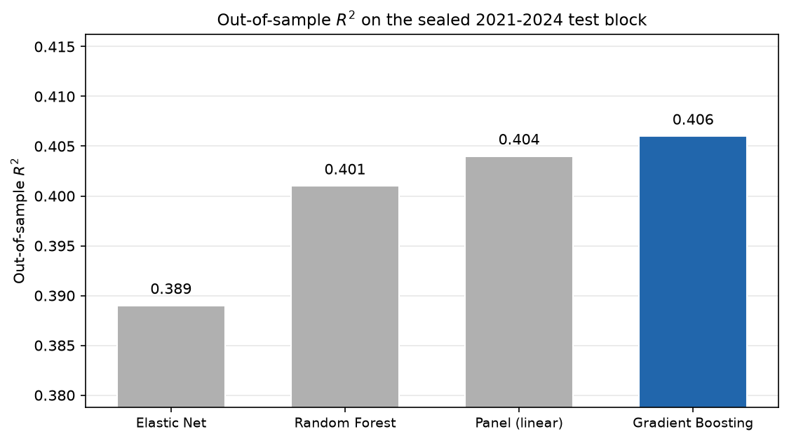
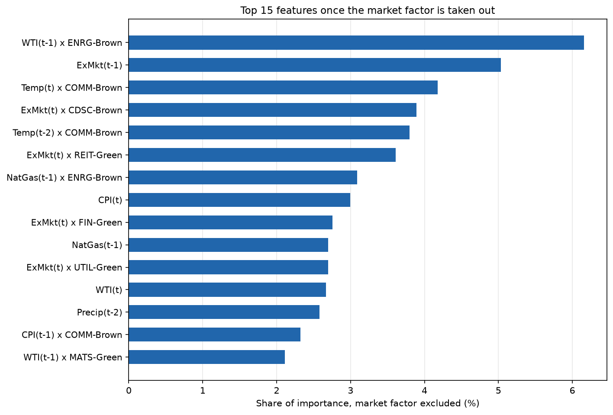
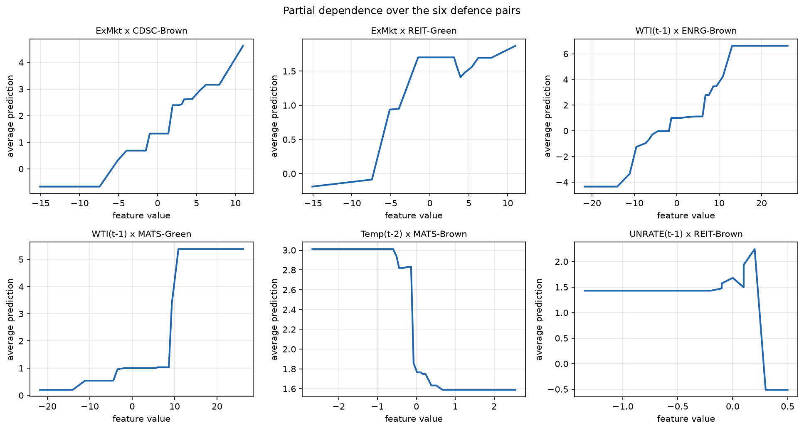
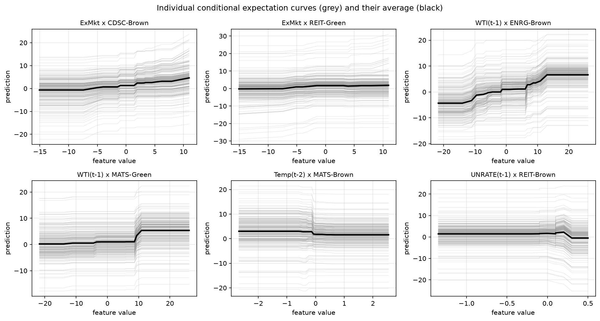
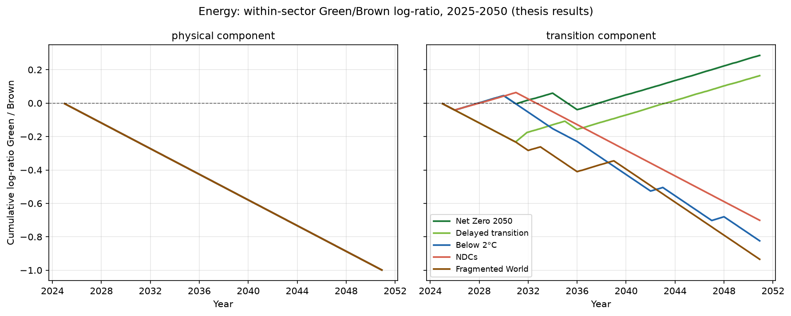
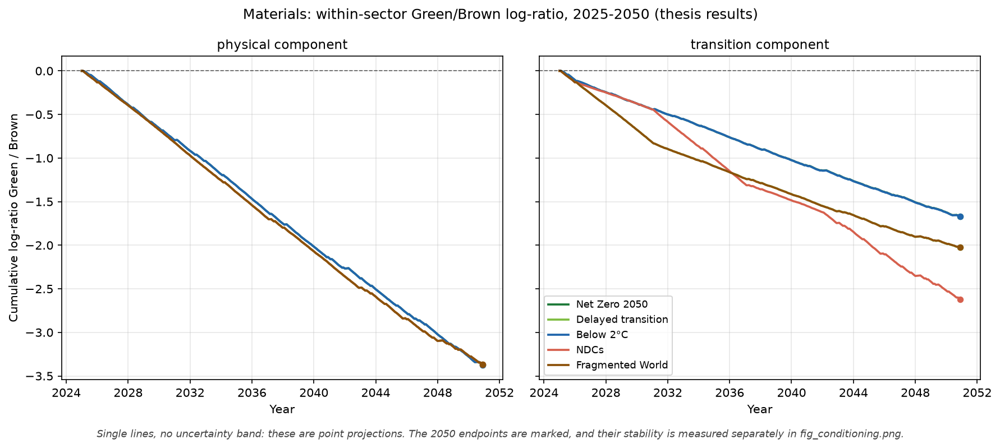

# Stock market returns under different climate scenarios

Is the Green–Brown return differential *within the same sector* a structural feature of a
portfolio, or does it depend on which climate scenario the economy follows? This repository
holds the modelling pipeline built to answer that question, and the results it produces.

## What is here

The modelling pipeline of the thesis, in Python: the construction of the candidate feature space,
the Gradient Boosting model selected in chapter 3, the interpretation machinery behind the defence
figures, and the 2025-2050 scenario projection. The aggregated results are in `results/` and the
figures used below are in `figures/`.

The underlying data are proprietary and are not distributed, so the code reads end to end but does
not run without them; see [Data availability](#data-availability).

## Setup

22 US sector portfolios (11 GICS sectors, each split into an ESG top-25% "Green" and a bottom-25%
"Brown" leg), monthly data 2005–2024. Four models are compared out-of-sample on a sealed
2021–2024 test block; the winner is projected on the NGFS scenarios to 2050; the final metric is
the within-sector Green/Brown log-ratio.

## Repository layout

```
src/
  build_features.py   24 drivers -> 552 candidates -> 73-feature winning set,
                      checked column by column against the reference design matrix
  train_gb.py         the two estimation windows: 189 months for the
                      out-of-sample metrics, 237 for the projection
  evaluate.py         out-of-sample R2 and RMSE on the sealed test block
  interpret.py        PDP and ICE curves for the six defence pairs
  scenarios.py        2025-2050 projection and Green/Brown log-ratio
  matlab_policy_gb.py least-squares boosting in numpy, with breadth-first tree
                      growth under a budget on the number of splits
scripts/
  make_figures.py     regenerates everything in figures/
  make_tables.py      builds results/mean_differences_table.csv
  reexport_data_private.py    writes the private CSVs at %.17g so they
                      round-trip exactly; run once, before anything else
results/              aggregated results, see Data availability
figures/              all figures used below
```

Run order, from the repository root:

```bash
python src/build_features.py && python src/train_gb.py && python src/evaluate.py && python src/interpret.py && python src/scenarios.py && python scripts/make_tables.py && python scripts/make_figures.py
```

The `src/` steps need `data_private/`, which is not distributed (see
[Data availability](#data-availability)). `scripts/make_tables.py` and the figures built from
`results/` need no private data.

Some files in `results/` are exports that this code does not rebuild; they are listed under
[Data availability](#data-availability).

---

## Method

The model is a gradient-boosted tree ensemble. This section states how its trees are
constrained, how its hyper-parameters were chosen, and on which samples it is estimated —
in that order, because each step depends on the one before.

### Tree growth: a budget on splits, not a depth limit

The trees are grown breadth-first under a budget on the *number of splits*: the tree grows level by
level, and when a level would overrun the budget, the least productive splits of that level are
undone.

This is where a naming convention needs spelling out, because it otherwise reads as a contradiction.
The grid below has an axis called **depth**, taking values 3, 4 and 5, and those values are shorthand
for split budgets of 7, 15 and 31 — the number of branch nodes a *complete* tree of that depth would
have, since 1 + 2 + 4 + 8 = 15. The selected value, depth 4, therefore means a budget of **15
splits**, not a ceiling on how deep a tree may go. The two coincide only when the tree is complete.

On this design they do not coincide. Many nodes cannot be split at all, because an interaction
column is constant inside them, so a level often uses less than its share of the budget and what is
left is spent further down. The result is unbalanced trees that reach **depth 12** while still
holding to 15 splits each. Reading "depth 4" as a depth limit would describe a different and smaller
model.

[`src/matlab_policy_gb.py`](src/matlab_policy_gb.py) implements this, with an equivalence test that
pins the convention down: given a budget of `2**d - 1` on data where every node *can* split, it must
reproduce a depth-`d` tree exactly, which it does at depths 2, 3 and 4.

### Hyperparameter optimization

The configuration used throughout — **learning rate 0.03 with 300 learners, a budget of 15 splits
per tree, minimum leaf size 10, no subsampling** — is the output of a hyperparameter optimization
carried out in the thesis. It is not tuned in this repository and it is not hand-picked: the search
space, the selection criterion and the protocol are all fixed in advance, and are set out here so a
reader can see what they were.

**Feature selection is settled before the search begins.** A deliberately permissive reference model
— learning rate 0.01, four leaves, minimum leaf size 10 — is fitted on all 552 candidates, and 101
of them come out with positive importance. Reading that ranking at 99% of cumulative importance
gives the smallest top-K window that reaches the threshold, K = 62, to which the thesis adds 23
forced market terms (contemporaneous ExMkt and its 22 entity interactions, eleven of which fall
outside the window and are restored). The resulting 73-feature set is fixed from that point on. It
is chosen before the grid is entered and never revisited afterwards, so the search cannot quietly
select features and hyper-parameters against the same data.

**Search space.** An exhaustive grid, defined a priori, over

| Axis | Values |
|---|---|
| learning rate η | 0.02, 0.03, 0.05, 0.07, 0.10 |
| number of learners M | tied to η as M = round(900 × 0.01 / η): 450, 300, 180, 129, 90 |
| tree depth, that is the split budget | 3, 4, 5 — budgets of 7, 15 and 31 splits |
| minimum leaf size | 5, 8, 10, 12, 15, 20, 30 |
| subsample rate | 0.5, 0.8, 1.0 |

That is 5 × 3 × 7 × 3 = **315 configurations**. The number of learners is not a free axis: it is
pinned to the learning rate so that η × M is the same across the grid — 9 in every cell, up to the
rounding of M — which holds the total amount of learning constant and stops the comparison turning
into a contest between long slow runs and short fast ones.

**Validation window and selection criterion.** Selection is scored by RMSE on a held-out 24-month
validation window, in two stages. The first pass scores all 315 configurations — five seeds each for
the stochastic settings, a single fit for the deterministic ones, which are deterministic precisely
because subsampling is off. The finalists are then re-scored over 30 seeds, so that a configuration
cannot win on a lucky initialisation: the second stage separates the signal from initialisation
variance.

**Sealed test set.** The 2021–2024 block takes no part in any of this. It is not used to score
candidates, not used to pick finalists, and not consulted between stages. The selected configuration
is refitted on the 189 training months and evaluated against that block exactly once, which is what
makes the reported out-of-sample figures an out-of-sample result rather than a selection statistic.

Once selected, these values are fixed. Nothing downstream re-optimizes them: the projection changes
the estimation sample and nothing else, as the next section describes.

### Two estimation windows

The same configuration is estimated twice, on two different samples, because the two answer
different questions.

The **189-month window**, running to December 2020, is the one that carries the out-of-sample
metrics: it stops before the sealed block, so the 2021–2024 figures are a genuine out-of-sample
result. The **237-month window**, running to December 2024, is the one that carries the 2025–2050
projection. Appendix A.3 of the thesis sets out the reason: the scenario anchors are recomputed on
the same window as the estimation, so each configuration is internally consistent, and projecting
from a model that stops in 2020 would leave four years of realised data unused. The two are kept
apart in the code as well — `prepare_fit_a` and `prepare_fit_b` in
[`src/train_gb.py`](src/train_gb.py) — and the projection calls the second.

**The risk-free path.** The projection compounds the total return, `yhat + RF`, not the excess
return. The scenario design file carries no risk-free column, so the path is joined from the
scenario predictions in `results/`, where RF is constant across entities within a scenario,
component and month.

---

## 1. Why machine learning is necessary, not decorative

The linear panel cannot answer the research question, by construction. In that specification Green
enters only as an intercept shift (δ ≈ −0.63) with no interaction terms. Projected on the five
scenarios, it returns the same differential in all five. A linear model of this form can only ever
say "structural"; it has no way to represent a scenario-dependent answer.

The differential lives in the interactions. Any effect common to both legs of a sector cancels in
the log-ratio, so only a driver tied to one specific portfolio can open a gap. That is what the
candidate space is built for: 552 features, made of 24 driver-lags interacted with 22 entities plus
the 24 main effects. The panel is split 70-10-20, with the last block sealed and untouched until
the final evaluation.

`src/build_features.py` builds this space from the base panel and checks itself against the
reference design matrix shipped with the private inputs: on the 189-month estimation sample the two
agree column by column, with a maximum absolute difference of 0.

## 2. Model selection by four criteria, not by R²



The four models are nearly tied out-of-sample: Elastic Net 0.389, Random Forest 0.401, Panel 0.404,
Gradient Boosting 0.407. A gap of 0.018 across four very different specifications is not a ranking.

The choice was made by progressive elimination on four criteria:

| Criterion | Consequence |
|---|---|
| No standardisation required | rules out Elastic Net |
| Non-linearity needed | rules out Elastic Net and the panel |
| Determinism | rules out Random Forest |
| Parsimony | 73 features against 155 |

Gradient Boosting is the only model not dominated on any of the four. Its configuration — the
73-feature set, learning rate 0.03 with 300 learners, a budget of 15 splits per tree, minimum leaf
size 10, no subsampling — is the one described under [Method](#method). Fit is confirmation, not
reason.

**Gradient Boosting, fitted on the 189 estimation months and scored on the sealed 2021–2024 block:**

| | in-sample (189 months) | out-of-sample (sealed block) |
|---|---|---|
| R² | 0.7065 | 0.4070 |
| RMSE | 3.8182 | 5.1058 |

The gap between the two, 0.30 in R², is the honest cost of a model with 73 features on 4,158
monthly observations. It is reported rather than tuned away: the test block is scored once, after
the configuration is fixed.



Importance is measured throughout as each feature's share of the total reduction in squared error.
On that scale the contemporaneous market factor alone takes 68.7%, aggregate terms take 76.8%, and
one predictor of the 73 contributes nothing at all.

## 3. Interpretability with a built-in falsification test



The partial dependence curves are step functions even in the channels that are close to linear —
the market channel has a linear R² of 0.95 and still produces steps. The same variable takes
different shapes on different portfolios: this is exactly the heterogeneity the linear panel cannot
see, because there the same coefficient is imposed everywhere.



The ICE curves are parallel. That matters: it means the average curve is representative of the
individual observations and not an artefact of averaging over conflicting shapes. If the individual
curves crossed, the PDP would be a summary of nothing.

Both curves follow the sweep logic the interaction design requires: a feature like WTI x ENRG-Brown
is non-zero only on the rows of its own entity, so the grid is applied to those rows and the
predictions averaged over them.

The falsification test is the pivot between two sectors. Communication carries the heaviest
interaction budget — 24% of it, of which 13.8 sits on temperature — and it barely separates the
scenarios (range 0.11). Energy carries less — 16%, of which 14.3 sits on fuel — and it separates
everything (range 0.39). The reason is not in the model but in the drivers: temperature paths do
not diverge across scenarios by 2050, fuel paths do. What matters is the channel, not the weight.
When the model does not separate, it is because the driver does not separate. Interactions take
23.2% of the total importance budget, the complement of the 76.8% held by the aggregate terms.

## 4. What the model finds



Energy is the sector where the scenario matters most, and the robust part of the finding is which
pathways put the green leg ahead. In the transition component at 2050, Net Zero +0.29 and Delayed
transition +0.16 are both positive; NDCs −0.70, Below 2°C −0.82 and Fragmented World −0.93 are
below them.

The physical panel of the Energy figure is the other half of the finding, and it is kept there on
purpose: under that component the five scenarios lie exactly on top of each other. The Energy spread
across scenarios is 0.00 for physical against 1.22 for transition. All of the separation is
transition risk.

The ordering is not a simple ranking of ambition. It takes ambition *and* speed together: Net Zero
and Delayed transition have both, Below 2°C has ambition without speed, Fragmented World has speed
without ambition, NDCs has neither. Net Zero sits at the green extreme and Delayed transition beside
it, and that placement is the durable part of the finding.

The crossing of zero is a different kind of statement, and a weaker one. Whether the remaining three
pathways land below zero or merely below Net Zero is a property of the *level* of the log-ratio, and
the level shifts with the estimation window. Appendix A.3 of the thesis treats it that way, and so
should a reader of this repository: the result to take away is which pathways put the green leg
ahead, not that Energy inverts its sign — the latter is a description of this particular fit rather
than a property of the sector.



Materials behaves differently. The brown leg is ahead under every pathway; only the size of the gap
changes, from −1.67 under Net Zero (tightest) to −2.62 under NDCs (widest). The shock enters as a
cost rather than as an advantage: green does not become better, it becomes less bad.

### Mean 2025–2050 differences by sector and scenario

Average over 2025–2050 of the monthly difference between the predicted return of the Green and the
Brown portfolio of each sector, by scenario, with the range across scenarios in the last column. No
significance tests are reported here; the tests are in the thesis.

**Transition component**

| Sector | Net Zero | Delayed | Below 2C | NDCs | Fragmented | Range |
|---|---|---|---|---|---|---|
| CDSC | 0.224 | 0.215 | 0.224 | 0.224 | 0.215 | 0.009 |
| COMM | -2.051 | -2.150 | -2.036 | -2.085 | -2.136 | 0.114 |
| CSTP | -0.246 | -0.225 | -0.246 | -0.231 | -0.231 | 0.021 |
| ENRG | 0.092 | 0.053 | -0.267 | -0.227 | -0.303 | 0.395 |
| FIN | 0.000 | 0.001 | 0.000 | 0.000 | 0.000 | 0.001 |
| HLTC | -0.165 | -0.165 | -0.165 | -0.165 | -0.165 | 0.000 |
| IND | -0.112 | -0.108 | -0.112 | -0.112 | -0.108 | 0.004 |
| INFT | -0.623 | -0.648 | -0.594 | -0.616 | -0.622 | 0.054 |
| MATS | -0.544 | -0.660 | -0.545 | -0.856 | -0.660 | 0.312 |
| REIT | -0.012 | -0.016 | -0.012 | -0.014 | -0.014 | 0.004 |
| UTIL | 0.000 | 0.000 | 0.000 | 0.000 | 0.000 | 0.000 |

**Physical component**

| Sector | Net Zero | Delayed | Below 2C | NDCs | Fragmented | Range |
|---|---|---|---|---|---|---|
| CDSC | 0.224 | 0.224 | 0.224 | 0.224 | 0.224 | 0.001 |
| COMM | -1.970 | -2.091 | -1.974 | -2.081 | -2.073 | 0.121 |
| CSTP | -0.246 | -0.231 | -0.246 | -0.231 | -0.231 | 0.016 |
| ENRG | -0.323 | -0.323 | -0.323 | -0.323 | -0.323 | 0.000 |
| FIN | 0.000 | 0.000 | 0.000 | 0.000 | 0.000 | 0.000 |
| HLTC | -0.165 | -0.165 | -0.165 | -0.165 | -0.165 | 0.000 |
| IND | -0.112 | -0.112 | -0.112 | -0.112 | -0.112 | 0.000 |
| INFT | -0.605 | -0.598 | -0.605 | -0.600 | -0.600 | 0.007 |
| MATS | -1.102 | -1.099 | -1.102 | -1.099 | -1.099 | 0.002 |
| REIT | -0.020 | -0.019 | -0.020 | -0.020 | -0.020 | 0.001 |
| UTIL | 0.000 | 0.000 | 0.000 | 0.000 | 0.000 | 0.000 |

Full table: [`results/mean_differences_table.csv`](results/mean_differences_table.csv).

## 5. Conclusion: conditional, but local

The response to the pathway is graded, not binary, and it is concentrated. Ranking the 11 sectors by
the range of their mean 2025–2050 differential across scenarios: Energy 0.395 and Materials 0.312
stand apart; Communication 0.114 and Information Technology 0.054 are small but not nothing; the
remaining seven are all below 0.03, six of them below 0.01, and two are exactly zero.

Sectors are ranked by the size of that response rather than counted by whether their log-ratio
crosses zero, and the choice matters. How much a sector's differential moves when the pathway
changes is a property of the sector: it is the gap between what the model predicts under one set of
driver paths and another, and nothing outside the sector fixes its size. Crossing zero is a
different kind of quantity. It depends on the level the differential happens to sit around, and
that level shifts with the estimation window — appendix A.3 of the thesis makes the same point.
Ranking by response also needs no cut-off, so nothing hinges on where a boundary is drawn: Energy
first by a wide margin, Materials second, everything else far behind.

So the answer to the research question is not "structural" and not "conditional", but conditional in
a specific place and through a specific channel. In Energy the channel is fuel, and the pathways
that put the green leg ahead are the ones combining ambition with speed.

## Limitations and future work

**Why the gains over the linear benchmark are modest.** Most of the predictable variance comes from
the contemporaneous market factor, which is linear, so the ceiling for improvement was low by
construction of the problem. Monthly equity returns have a very low signal-to-noise ratio, and
roughly 190 effective training months limit what trees can learn — consistent with what Gu, Kelly
and Xiu report for machine learning in asset pricing. Machine learning was chosen here for
expressiveness, not for fit: the linear model cannot even represent a scenario-dependent
differential, by construction. R² measures total-return prediction, while the object of interest is
a second-order differential that R² barely sees.

**Style factors are excluded.** No scenario path exists for them, so they cannot be projected. The
within-sector design attenuates the omission but does not remove it.

**The time dimension is narrow from both sides.** The data are monthly while the NGFS scenarios are
annual, and ESG coverage thins out before 2005.

**A single ESG provider.** Ratings diverge across providers, and the Green/Brown sorting inherits
that choice.

**Scenario paths are smooth by construction.** The projections should be read as directions of
adjustment, not as magnitudes, which is the conclusion the thesis reaches from the low volatility of
the NGFS paths. The design of the projection gives a second reason for the same caution. The
projected fuel path over 2025–2050 spans roughly 0.04 to 1.85, about three per cent of the range the
model was trained on and sitting close to its median. A boosted tree is a step function, so over an
interval that narrow the level of the answer depends on whether a step edge happens to fall inside
it, while the ranking across scenarios does not. The practical consequence is that the ordering of
the pathways carries the finding and the absolute levels do not: which scenarios put the green leg
ahead is the result, and by how much is not a calibrated quantity.

**The two scenario-sensitive sectors depend on the design.** A richer model might find others.
Communication hints at why: its interaction budget sits on temperature, which does not separate
scenarios by 2050.

**Future work.** Longer or higher-frequency samples; penalised linear models with explicit
interaction terms as a sharper benchmark; news-based transition-risk indicators alongside physical
anomalies; neural approaches if more data becomes available; uncertainty quantification on the
scenario projections.

## Data availability

The underlying data are proprietary. Market and ESG data come from Datastream, macroeconomic series
from FRED, and climate variables from ISIMIP. None of them are redistributed here, and the folder
that holds them, `data_private/`, is excluded from version control.

What is published is the complete modelling code, the aggregated results in `results/` and the
figures in `figures/`. The code in `src/` is therefore readable end to end but not runnable without
`data_private/`; every module fails with an explicit message pointing to this section when an input
file is missing.

Some files in `results/` are exports of results computed before this code existed and are not
rebuilt by it: `logratio_green_brown.csv`, `scenario_monthly_predictions.csv`,
`cumulative_returns.csv`, `oos_model_comparison.csv`, `gb_final_metrics.csv`, `en_metrics.csv` and
`gb_feature_importance.csv`. They are tracked because they cannot be reconstructed without the
proprietary inputs.

## Citation

Claudio Andreassi, PhD in Economics, University of Perugia (2026). Supervisor: Prof. Marco
Nicolosi.

## License

MIT — see [LICENSE](LICENSE).
